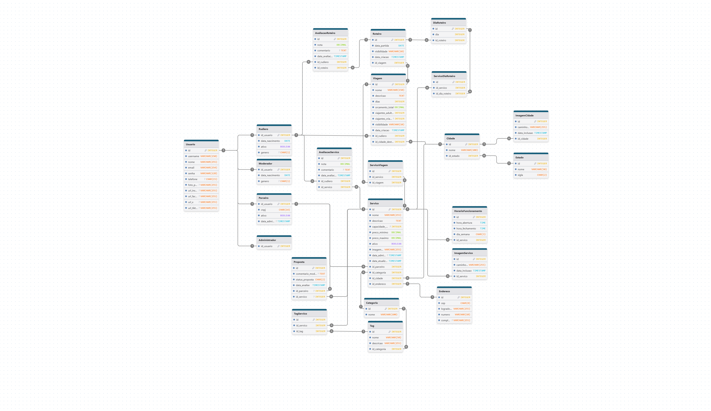

# Modelo de Dados

## Modelo Relacional

### [Documento DrawDB - Diagrama Relacional - Rudiá](diagrama_relacional_rudia_3.0.drawio)

 

## 📋 Dicionário de Dados

### **Tabela** : Usuario

### **Descrição** : Tabela contendo os dados comuns aos usuários do sistema

| Colunas | Descrição | Tipo de Dado | Tamanho | Null | PK | FK | Unique | Identity | Default | Constraints | 
| ------- | --------- | ------------ | ------- | ---- | -- | -- | ------ | -------- | ------- | ----------- |
| id | Identificador | INTEGER | - | ❌ | ✅ | ❌ | ✅ | ✅ | - | - | 
| username | Nome do usuário no sistema | VARCHAR | 150 | ❌ | ❌ | ❌ | ✅ | ❌ | - | - |
| nome | Nome completo do usuário | VARCHAR | 255 | ❌ | ❌ | ❌ | ❌ | ❌ | - | - |
| email | Endereço de e-mail do usuário | VARCHAR | 254 | ❌ | ❌ | ❌ | ✅ | ❌ | - | - |
| senha | Senha criptografada do usuário | VARCHAR | 128 | ❌ | ❌ | ❌ | ❌ | ❌ | - | - |
| telefone | Número de telefone do usuário | CHAR | 15 | ✅ | ❌ | ❌ | ✅ | ❌ | - | - |
| foto_perfil | Caminho (PATH) da foto de perfil do usuário | VARCHAR | 255 | ✅ | ❌ | ❌ | ❌ | ❌ | - | - |
| url_instagram | URL do perfil do Instagram do usuário | VARCHAR | 255 | ✅ | ❌ | ❌ | ✅ | ❌ | - | - |
| url_facebook | URL do perfil do Facebook do usuário | VARCHAR | 255 | ✅ | ❌ | ❌ | ✅ | ❌ | - | - |
| url_X | URL do perfil do X (Twitter) do usuário | VARCHAR | 255 | ✅ | ❌ | ❌ | ✅ | ❌ | - | - |
| url_tiktok | URL do perfil do TikTok do usuário | VARCHAR | 255 | ✅ | ❌ | ❌ | ✅ | ❌ | - | - |

 

### **Tabela** : Rudiero

### **Descrição** : Tabela contendo os dados específicos dos usuários do tipo **Rudiero**

| Colunas | Descrição | Tipo de Dado | Tamanho | Null | PK | FK | Unique | Identity | Default | Constraints |
| ------- | --------- | ------------ | ------- | ---- | -- | -- | ------ | -------- | ------- | ----------- |
| id_usuario | Identificador | INTEGER | - | ❌ | ✅ | ✅ | ✅ | ❌ | - | - |
| data_nascimento | Data de nascimento do Rudiero | DATE | - | ❌ | ❌ | ❌ | ❌ | ❌ | - | CHECK(data_nascimento <= CURRENT_DATE - INTERVAL '18 years') |
| ativo | Indica se a conta do rudiero está ativo no sistema | BOOLEAN | - | ❌ | ❌ | ❌ | ❌ | ❌ | FALSE | - |
| genero | Gênero do Rudiero | CHAR | 1 | ✅ | ❌ | ❌ | ❌ | ❌ | N | - |

 

### **Tabela** : Parceiro

### **Descrição** : Tabela contendo os dados específicos dos usuários do tipo **Parceiro**

| Colunas | Descrição | Tipo de Dado | Tamanho | Null | PK | FK | Unique | Identity | Default | Constraints |
| ------- | --------- | ------------ | ------- | ---- | -- | -- | ------ | -------- | ------- | ----------- |
| id_usuario | Identificador | INTEGER | - | ❌ | ✅ | ✅ | ✅ | ❌ | - | - |
| cnpj | CNPJ do parceiro que oferece os serviços | CHAR | 14 | ❌ | ❌ | ❌ | ✅ | ❌ | - | - |
| ativo | Indica se a conta do parceiro está ativo no sistema | BOOLEAN | - | ❌ | ❌ | ❌ | ❌ | ❌ | FALSE | - |
| data_admissao | Data e hora da admissão do parceiro | TIMESTAMP | - | ✅ | ❌ | ❌ | ❌ | ❌ | NULL | - |

 

### **Tabela** : Proposta

### **Descrição** : Tabela contendo as análises das propostas de parceria e serviço dos usuários do tipo **Parceiro**

| Colunas | Descrição | Tipo de Dado | Tamanho | Null | PK | FK | Unique | Identity | Default | Constraints |
| ------- | --------- | ------------ | ------- | ---- | -- | -- | ------ | -------- | ------- | ----------- |
| id | Identificador | INTEGER | - | ❌ | ✅ | ❌ | ✅ | ✅ | - | - |
| comentario_moderador | Comentário feito pelo Moderador na análise da proposta | TEXT | - | ✅ | ❌ | ❌ | ❌ | ❌ | - | - |
| status_proposta | Status da proposta analisada | CHAR | 2 | ❌ | ❌ | ❌ | ❌ | ❌ | EA | CHECK(status_proposta IN ('EA', 'AP', 'RP')) |
| data_analise | Data e hora da análise da proposta | TIMESTAMP | - | ❌ | ❌ | ❌ | ❌ | ❌ | CURRENT_TIMESTAMP | - |
| id_parceiro | Identificador do parceiro que fez a proposta | INTEGER | - | ✅ | ❌ | ✅ | ❌ | ❌ | - | - |
| id_servico | Identificador do serviço que foi proposto | INTEGER | - | ✅ | ❌ | ✅ | ❌ | ❌ | - | - |

 

### **Tabela** : Moderador

### **Descrição** : Tabela contendo os dados específicos dos usuários do tipo **Moderador**

| Colunas | Descrição | Tipo de Dado | Tamanho | Null | PK | FK | Unique | Identity | Default | Constraints |
| ------- | --------- | ------------ | ------- | ---- | -- | -- | ------ | -------- | ------- | ----------- |
| id_usuario | Identificador | INTEGER | - | ❌ | ✅ | ✅ | ✅ | ❌ | - | - |
| data_nascimento | Data de nascimento do Moderador | DATE | - | ❌ | ❌ | ❌ | ❌ | ❌ | - | CHECK(data_nascimento <= CURRENT_DATE - INTERVAL '18 years') |
| genero | Gênero do Moderador | CHAR | 1 | ✅ | ❌ | ❌ | ❌ | ❌ | N | CHECK (genero IN ('M','F','O','N')) |

 

### **Tabela** : Administrador

### **Descrição** : Tabela contendo os dados do gerente do sistema

| Colunas | Descrição | Tipo de Dado | Tamanho | Null | PK | FK | Unique | Identity | Default | Constraints |
| ------- | --------- | ------------ | ------- | ---- | -- | -- | ------ | -------- | ------- | ----------- |
| id_usuario | Identificador | INTEGER | - | ❌ | ✅ | ✅ | ✅ | ❌ | - | - |

 

### **Tabela** : Servico

### **Descrição** : Tabela contendo os dados dos serviços oferecidos pelos **Parceiros**

| Colunas | Descrição | Tipo de Dado | Tamanho | Null | PK | FK | Unique | Identity | Default | Constraints |
| ------- | --------- | ------------ | ------- | ---- | -- | -- | ------ | -------- | ------- | ----------- |
| id | Identificador | INTEGER | - | ❌ | ✅ | ❌ | ✅ | ✅ | - | - |
| nome | Nome do serviço | VARCHAR | 255 | ❌ | ❌ | ❌ | ❌ | ❌ | - | UNIQUE(nome, id_parceiro) |
| descricao | Descrição detalhada do serviço | TEXT | - | ❌ | ❌ | ❌ | ❌ | ❌ | - | - |
| capacidade_maxima | Capacidade máxima de pessoas para o serviço | INTEGER | - | ✅ | ❌ | ❌ | ❌ | ❌ | - | CHECK(capacidade_maxima > 0) |
| preco_minimo | Preço mínimo do serviço | DECIMAL | - | ❌ | ❌ | ❌ | ❌ | ❌ | - | CHECK(preco_minimo >= 0) |
| preco_maximo | Preço máximo do serviço | DECIMAL | - | ❌ | ❌ | ❌ | ❌ | ❌ | - | CHECK(preco_maximo >= preco_minimo) |
| ativo | Indica se o serviço está ativo no sistema | BOOLEAN | - | ❌ | ❌ | ❌ | ❌ | ❌ | FALSE | - |
| imagem_capa | Caminho (PATH) da foto de capa do serviço | VARCHAR | 255 | ❌ | ❌ | ❌ | ❌ | ❌ | - | - |
| data_admissao | Data e hora da admissão do serviço | TIMESTAMP | - | ✅ | ❌ | ❌ | ❌ | ❌ | NULL | - |
| data_atualizacao | Data e hora da última atualização do serviço | TIMESTAMP | - | ❌ | ❌ | ❌ | ❌ | ❌ | CURRENT_TIMESTAMP | - |
| id_parceiro | Identificador do parceiro que oferece o serviço | INTEGER | - | ❌ | ❌ | ✅ | ❌ | ❌ | - | - |
| id_categoria | Identificador da categoria do serviço | INTEGER | - | ❌ | ❌ | ✅ | ❌ | ❌ | - | - |
| id_cidade | Identificador da cidade onde o serviço é oferecido | INTEGER | - | ❌ | ❌ | ✅ | ❌ | ❌ | - | - |
| id_endereco | Identificador do endereço do serviço | INTEGER | - | ❌ | ❌ | ✅ | ❌ | ❌ | - | - |

 

### **Tabela** : HorarioFuncionamento

### **Descrição** : Tabela contendo os horários de funcionamento dos serviços oferecidos pelos **Parceiros**

| Colunas | Descrição | Tipo de Dado | Tamanho | Null | PK | FK | Unique | Identity | Default | Constraints |
| ------- | --------- | ------------ | ------- | ---- | -- | -- | ------ | -------- | ------- | ----------- |
| id | Identificador | INTEGER | - | ❌ | ✅ | ❌ | ✅ | ✅ | - | - |
| hora_abertura | Horário de abertura do serviço | TIME | - | ❌ | ❌ | ❌ | ❌ | ❌ | - | - |
| hora_fechamento | Horário de fechamento do serviço | TIME | - | ❌ | ❌ | ❌ | ❌ | ❌ | - | CHECK(hora_fechamento > hora_abertura) |
| dia_semana | Dia da semana com horário de funcionamento | CHAR | 3 | ❌ | ❌ | ❌ | ❌ | ❌ | - | CHECK(dia_semana IN ('DOM', 'SEG', 'TER', 'QUA', 'QUI', 'SEX', 'SAB')) |
| id_servico | Identificador do serviço | INTEGER | - | ❌ | ❌ | ✅ | ❌ | ❌ | - | - |

 

### **Tabela** : ImagemServico

### **Descrição** : Tabela contendo as imagens adicionais dos serviços oferecidos pelos **Parceiros**

| Colunas | Descrição | Tipo de Dado | Tamanho | Null | PK | FK | Unique | Identity | Default | Constraints |
| ------- | --------- | ------------ | ------- | ---- | -- | -- | ------ | -------- | ------- | ----------- |
| id | Identificador | INTEGER | - | ❌ | ✅ | ❌ | ✅ | ✅ | - | - |
| caminho_imagem | Caminho (PATH) da imagem do serviço | VARCHAR | 255 | ❌ | ❌ | ❌ | ❌ | ❌ | - | - |
| data_inclusao | Data e hora da inclusão da imagem | TIMESTAMP | - | ❌ | ❌ | ❌ | ❌ | ❌ | CURRENT_TIMESTAMP | - |
| id_servico | Identificador do serviço | INTEGER | - | ❌ | ❌ | ✅ | ❌ | ❌ | - | - |

 

### **Tabela** : Endereco

### **Descrição** : Tabela contendo o endereço dos serviços oferecidos pelos **Parceiros**

| Colunas | Descrição | Tipo de Dado | Tamanho | Null | PK | FK | Unique | Identity | Default | Constraints |
| ------- | --------- | ------------ | ------- | ---- | -- | -- | ------ | -------- | ------- | ----------- |
| id | Identificador | INTEGER | - | ❌ | ✅ | ❌ | ✅ | ✅ | - | - |
| cep | Código postal (CEP) do endereço | CHAR | 8 | ❌ | ❌ | ❌ | ❌ | ❌ | - | - |
| logradouro | Logradouro do endereço | VARCHAR | 255 | ❌ | ❌ | ❌ | ❌ | ❌ | - | UNIQUE(logradouro, numero) |
| numero | Número do endereço | VARCHAR | 10 | ❌ | ❌ | ❌ | ❌ | ❌ | - | - |
| complemento | Complemento do endereço | VARCHAR | 255 | ✅ | ❌ | ❌ | ❌ | ❌ | - | - |

 

### **Tabela** : Categoria

### **Descrição** : Tabela contendo as categorias dos serviços oferecidos pelos **Parceiros**

| Colunas | Descrição | Tipo de Dado | Tamanho | Null | PK | FK | Unique | Identity | Default | Constraints |
| ------- | --------- | ------------ | ------- | ---- | -- | -- | ------ | -------- | ------- | ----------- |
| id | Identificador | INTEGER | - | ❌ | ✅ | ❌ | ✅ | ✅ | - | - |
| nome | Nome da categoria | VARCHAR | 100 | ❌ | ❌ | ❌ | ✅ | ❌ | - | - |

 

### **Tabela** : Tag

### **Descrição** : Tabela contendo as tags das categorias dos serviços oferecidos pelos **Parceiros**

| Colunas | Descrição | Tipo de Dado | Tamanho | Null | PK | FK | Unique | Identity | Default | Constraints |
| ------- | --------- | ------------ | ------- | ---- | -- | -- | ------ | -------- | ------- | ----------- |
| id | Identificador | INTEGER | - | ❌ | ✅ | ❌ | ✅ | ✅ | - | - |
| nome | Nome da tag | VARCHAR | 50 | ❌ | ❌ | ❌ | ❌ | ❌ | - | UNIQUE(nome, id_categoria) |
| descricao | Descrição da tag | VARCHAR | 255 | ❌ | ❌ | ❌ | ❌ | ❌ | - | - |
| id_categoria | Identificador da categoria associada à tag | INTEGER | - | ❌ | ❌ | ✅ | ❌ | ❌ | - | - |

 

### **Tabela** : TagServico

### **Descrição** : Tabela associativa entre tags e serviços

| Colunas | Descrição | Tipo de Dado | Tamanho | Null | PK | FK | Unique | Identity | Default | Constraints |
| ------- | --------- | ------------ | ------- | ---- | -- | -- | ------ | -------- | ------- | ----------- |
| id | Identificador | INTEGER | - | ❌ | ✅ | ❌ | ✅ | ✅ | - | - |
| id_tag | Identificador da tag | INTEGER | - | ❌ | ❌ | ✅ | ❌ | ❌ | - | - |
| id_servico | Identificador do serviço | INTEGER | - | ❌ | ❌ | ✅ | ❌ | ❌ | - | - |

 

### **Tabela** : Cidade

### **Descrição** : Tabela contendo as cidades onde os serviços são oferecidos e onde os roteiros são destinados

| Colunas | Descrição | Tipo de Dado | Tamanho | Null | PK | FK | Unique | Identity | Default | Constraints |
| ------- | --------- | ------------ | ------- | ---- | -- | -- | ------ | -------- | ------- | ----------- |
| id | Identificador | INTEGER | - | ❌ | ✅ | ❌ | ✅ | ✅ | - | - |
| nome | Nome da cidade | VARCHAR | 100 | ❌ | ❌ | ❌ | ❌ | ❌ | - | UNIQUE(nome, id_estado) |
| id_estado | Identificador do estado onde a cidade está localizada | INTEGER | - | ❌ | ❌ | ✅ | ❌ | ❌ | - | - |

 

### **Tabela** : Estado

### **Descrição** : Tabela contendo os estados onde as cidades estão localizadas

| Colunas | Descrição | Tipo de Dado | Tamanho | Null | PK | FK | Unique | Identity | Default | Constraints |
| ------- | --------- | ------------ | ------- | ---- | -- | -- | ------ | -------- | ------- | ----------- |
| id | Identificador | INTEGER | - | ❌ | ✅ | ❌ | ✅ | ✅ | - | - |
| nome | Nome do estado | VARCHAR | 50 | ❌ | ❌ | ❌ | ✅ | ❌ | - | - |
| sigla | Sigla do estado | CHAR | 2 | ❌ | ❌ | ❌ | ✅ | ❌ | - | - |

 

### **Tabela** : ImagemCidade

### **Descrição** : Tabela contendo imagens adicionais das cidades

| Colunas | Descrição | Tipo de Dado | Tamanho | Null | PK | FK | Unique | Identity | Default | Constraints |
| ------- | --------- | ------------ | ------- | ---- | -- | -- | ------ | -------- | ------- | ----------- |
| id | Identificador | INTEGER | - | ❌ | ✅ | ❌ | ✅ | ✅ | - | - |
| caminho_imagem | Caminho (PATH) da imagem da cidade | VARCHAR | 255 | ❌ | ❌ | ❌ | ❌ | ❌ | - | - |
| data_inclusao | Data e hora da inclusão da imagem | TIMESTAMP | - | ❌ | ❌ | ❌ | ❌ | ❌ | CURRENT_TIMESTAMP | - |
| id_cidade | Identificador da cidade | INTEGER | - | ❌ | ❌ | ✅ | ❌ | ❌ | - | - |

 

### **Tabela** : AvaliacaoServico

### **Descrição** : Tabela Intermediaria que guarda as informaçoes das avaliações dos serviços feitas pelos **Rudieros**

| Colunas | Descrição | Tipo de Dado | Tamanho | Null | PK | FK | Unique | Identity | Default | Constraints |
| ------- | --------- | ------------ | ------- | ---- | -- | -- | ------ | -------- | ------- | ----------- |
| id | Identificador | INTEGER | - | ❌ | ✅ | ❌ | ✅ | ✅ | - | - |
| nota | Identificador | DECIMAL | - | ❌ | ❌ | ❌ | ❌ | ❌ | - | CHECK(nota >= 0) |
| comentario | Comentário da avaliação feita pelo Rudiero sobre o serviço | TEXT | - | ✅ | ❌ | ❌ | ❌ | ❌ | - | - |
| data_avaliacao | Data e hora da avalicao do serviço | TIMESTAMP | - | ❌ | ❌ | ❌ | ❌ | ❌ | CURRENT_TIMESTAMP | - |
| id_rudiero | Identificador do Rudiero que avaliou | INTEGER | - | ❌ | ❌ | ✅ | ❌ | ❌ | - | - |
| id_servico | Identificador do serviço avaliado | INTEGER | - | ❌ | ❌ | ✅ | ❌ | ❌ | - | - |

 

### **Tabela** : Viagem

### **Descrição** : Tabela contendo as viagens criadas pelos usuários do tipo **Rudiero**

| Colunas | Descrição | Tipo de Dado | Tamanho | Null | PK | FK | Unique | Identity | Default | Constraints |
| ------- | --------- | ------------ | ------- | ---- | -- | -- | ------ | -------- | ------- | ----------- |
| id | Identificador | INTEGER | - | ❌ | ✅ | ❌ | ✅ | ✅ | - | - |
| nome | Nome da viagem | VARCHAR | 150 | ❌ | ❌ | ❌ | ❌ | ❌ | - | - |
| descricao | Descrição detalhada da viagem | TEXT | - | ❌ | ❌ | ❌ | ❌ | ❌ | - | - |
| dias | Quantidade de dias da viagem | INTEGER | - | ❌ | ❌ | ❌ | ❌ | ❌ | - | CHECK(dias > 0) |
| orcamento_total | Orçamento total estimado para a viagem | DECIMAL | - | ❌ | ❌ | ❌ | ❌ | ❌ | - | CHECK(orçamento_total >= 0) |
| viajantes_adultos | Número de viajantes adultos na viagem | INTEGER | - | ❌ | ❌ | ❌ | ❌ | ❌ | 1 | - |
| viajantes_criancas | Número de viajantes crianças na viagem | INTEGER | - | ✅ | ❌ | ❌ | ❌ | ❌ | - | - |
| visibilidade | Define se a viagem é visivel para outros usuários | VARCHAR | 10 | ❌ | ❌ | ❌ | ❌ | ❌ | PRIVADO | CHECK(visibilidade IN ('PUBLICO', 'PRIVADO')) |
| data_criacao | Data e hora da criação da viagem | TIMESTAMP | - | ❌ | ❌ | ❌ | ❌ | ❌ | CURRENT_TIMESTAMP | - |
| id_rudiero | Identificador do Rudiero que criou a viagem | INTEGER | - | ❌ | ❌ | ✅ | ❌ | ❌ | - | - |
| id_cidade_destino | Identificador da cidade destino da viagem | INTEGER | - | ❌ | ❌ | ✅ | ❌ | ❌ | - | - |

 

### **Tabela** : ServicoViagem

### **Descrição** : Tabela associativa entre serviços e viagens

| Colunas | Descrição | Tipo de Dado | Tamanho | Null | PK | FK | Unique | Identity | Default | Constraints |
| ------- | --------- | ------------ | ------- | ---- | -- | -- | ------ | -------- | ------- | ----------- |
| id | Identificador | INTEGER | - | ❌ | ✅ | ❌ | ✅ | ✅ | - | - |
| id_servico | Identificador do serviço | INTEGER | - | ❌ | ❌ | ✅ | ❌ | ❌ | - | - |
| id_viagem | Identificador da viagem | INTEGER | - | ❌ | ❌ | ✅ | ❌ | ❌ | - | - |

 

## **Tabela** : Roteiro

### **Descrição** : Tabela contendo os roteiros das viagens criadas pelos usuários do tipo **Rudiero**

| Colunas | Descrição | Tipo de Dado | Tamanho | Null | PK | FK | Unique | Identity | Default | Constraints |
| ------- | --------- | ------------ | ------- | ---- | -- | -- | ------ | -------- | ------- | ----------- |
| id | Identificador | INTEGER | - | ❌ | ✅ | ❌ | ✅ | ✅ | - | - |
| data_partida | Data de inicio do roteiro planejado | DATE | - | ❌ | ❌ | ❌ | ❌ | ❌ | - | - |
| visibilidade | Define se o roteiro é visivel para outros usuários | VARCHAR | 10 | ❌ | ❌ | ❌ | ❌ | ❌ | PRIVADO | CHECK(visibilidade IN ('PUBLICO', 'PRIVADO')) |
| data_criacao | Data e hora da criação do roteiro | TIMESTAMP | - | ❌ | ❌ | ❌ | ❌ | ❌ | CURRENT_TIMESTAMP | - |
| id_viagem | Identificador da viagem | INTEGER | - | ❌ | ❌ | ✅ | ❌ | ❌ | - | - |

 

## **Tabela** : DiaRoteiro

### **Descrição** : Tabela relacionado as dias que compoem o roteiro planejado pelos usuários do tipo **Rudiero**

| Colunas | Descrição | Tipo de Dado | Tamanho | Null | PK | FK | Unique | Identity | Default | Constraints |
| ------- | --------- | ------------ | ------- | ---- | -- | -- | ------ | -------- | ------- | ----------- |
| id | Identificador | INTEGER | - | ❌ | ✅ | ❌ | ✅ | ✅ | - | - |
| dia | Número do dia correspondente a quantidade de dias do roteiro | INTERGER | - | ❌ | ❌ | ❌ | ❌ | ❌ | - | CHECK(dia > 0 AND dia <= viagem.dias) |
| id_roteiro | Identificador do roteiro | INTEGER | - | ❌ | ❌ | ✅ | ❌ | ❌ | - | - |

 

### **Tabela** : ServicoDiaRoteiro

### **Descrição** : Tabela associativa entre serviços e dia do roteiro

| Colunas | Descrição | Tipo de Dado | Tamanho | Null | PK | FK | Unique | Identity | Default | Constraints |
| ------- | --------- | ------------ | ------- | ---- | -- | -- | ------ | -------- | ------- | ----------- |
| id | Identificador | INTEGER | - | ❌ | ✅ | ❌ | ✅ | ✅ | - | - |
| id_servico | Identificador do serviço | INTEGER | - | ❌ | ❌ | ✅ | ❌ | ❌ | - | - |
| id_dia_roteiro | Identificador do dia do roteiro | INTEGER | - | ❌ | ❌ | ✅ | ❌ | ❌ | - | - |

 

## **Tabela** : AvaliacaoRoteiro

### **Descrição** : Tabela Intermediaria que guarda as informaçoes das avaliações dos roteiro feitos pelos **Rudieros**

| Colunas | Descrição | Tipo de Dado | Tamanho | Null | PK | FK | Unique | Identity | Default | Constraints |
| ------- | --------- | ------------ | ------- | ---- | -- | -- | ------ | -------- | ------- | ----------- |
| id | Identificador | INTEGER | - | ❌ | ✅ | ❌ | ✅ | ✅ | - | - |
| nota | Identificador | DECIMAL | - | ❌ | ❌ | ❌ | ❌ | ❌ | - | CHECK(nota >= 0) |
| comentario | Comentário da avaliação feita pelo Rudiero sobre o roteiro | TEXT | - | ✅ | ❌ | ❌ | ❌ | ❌ | - | - |
| data_avaliacao | Data e hora da avalicao do roteiro | TIMESTAMP | - | ❌ | ❌ | ❌ | ❌ | ❌ | CURRENT_TIMESTAMP | - |
| id_rudiero | Identificador do Rudiero que avaliou | INTEGER | - | ❌ | ❌ | ✅ | ❌ | ❌ | - | - |
| id_roteiro | Identificador do roteiro avaliado | INTEGER | - | ❌ | ❌ | ✅ | ❌ | ❌ | - | - |
