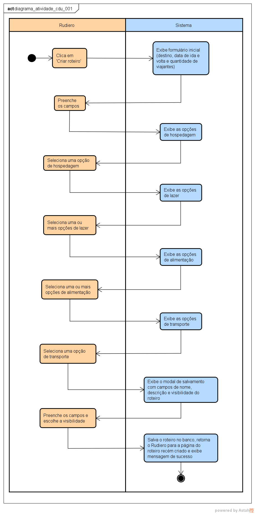

# CDU001. Criar Viagem Personalizado

- **Ator principal**: Rudiero
- **Atores secundários**: -
- **Resumo**: Elaboração de uma viagem completa a partir da seleção de serviços (hospedagem, lazer, alimentação e transporte) oferecidos pelos parceiros disponíveis na aplicação.
- **Pré-condição**:
1. O Rudiero deve estar logado em sua conta.
2. O Rudiero deve acessar a página de criação de **Viagem Personalizada** na barra de navegação da aplicação.
- **Pós-condição**:
1. A Viagem é salva na conta do Rudiero e persistida no sistema.

## Fluxo Principal
| Ações do ator | Ações do sistema |
| :-----------------: | :-----------------: | 
| 0 - Na tela inicial, o Rudiero clica no botão da barra de navegação **Criar Viagem** | - |
| - | 1 - O sistema exibe um primeiro formulário com as *informações básicas obrigatórias* para a criação da viagem: cidade destino, quantidade de dias e número de viajantes adultos e crianças da viagem |
| 2 - O Rudiero preenche os campos e clica em **Continuar** | - |
| - | 3 - O sistema direciona o Rudiero para a segunda etapa, **Hospedagem**, e exibe os serviços que condizentes com as informações anteriormente preenchidas |
| 4 - O Rudiero escolhe sua opção, limitada a uma, **Hospedagem** e clica em **Continuar** | - |
| - | 5 - O sistema exibi o valor parcial, até o momento, da viagem e direciona o Rudiero para a terceira etapa, **Lazer**, e exibe os serviços condizentes com as informações anteriormente preenchidas |
| 6 - O Rudiero seleciona uma ou mais opções de **Lazer** que deseja incluir na Viagem e clica em **Continuar** | - |
| - | 7 - O sistema exibi o valor parcial, até o momento, da viagem e direciona o Rudiero para a quarta etapa, **Alimentação**, e exibe os serviços condizentes com as informações anteriormente preenchidas |
| 8 - O Rudiero seleciona um ou mais opções de **Alimentação** que deseja incluir na Viagem e clica em **Continuar** | - |
| - | 9 - O sistema exibi o valor parcial, até o momento, da viagem e direciona o Rudiero para a quinta etapa, **Transporte**, e exibe os serviços condizentes com as informações anteriormente preenchidas |
| 10 - O Rudiero escolhe sua opção, limitada a uma, de **Transporte** e clica em **Continuar** | - |
| - | 11 - O sistema direcionar para a sexta etapa, contendo a exibição da pré visualização do card do viagem contendo a imagem da cidade de destino, orçamento total e avaliação, inicialmente zerada, e um formulário com as últimas *informações obrigatórias*: Nome, Descrição e Visibilidade |
| 12 - O Rudiero preenche os campos, seleciona uma das duas visibilidades (**Privado** (Padrão) ou **Público** para o viagem) e clica em **Salvar**| - |
| - | 13 - O sistema persiste o viagem criado pelo Rudiero, e exibi ainda na página de criação de viagem um modal de sucesso com as opções de **Ver Viagem Criada**, **Criar Nova Viagem** e **Voltar para Home** |
| 14 - O Rudiero escolhe a opção de **Ver Viagem Criada** | - |
| - | 15 - O sistema direciona o Rudiero para a area de **Gerenciamento de Minhas Viagens** (CDU-019) | 

## Fluxo Alternativo I - 
| Ações do ator       | Ações do sistema    |
| :-----------------: | :-----------------: | 
| - | - |

## Diagrama de Atividade

### [Documento Astah do Projeto Rudiá](../documento_projeto_rudia_astah/Documento_Projeto_Rudia.asta)
