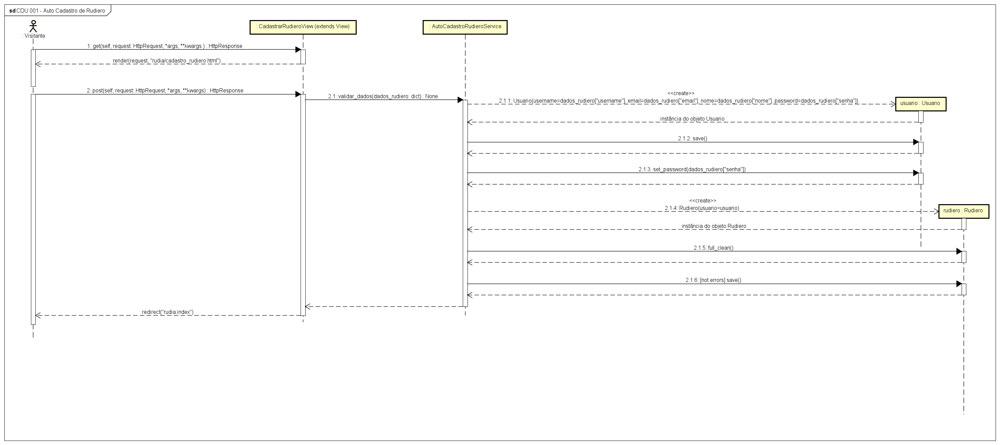
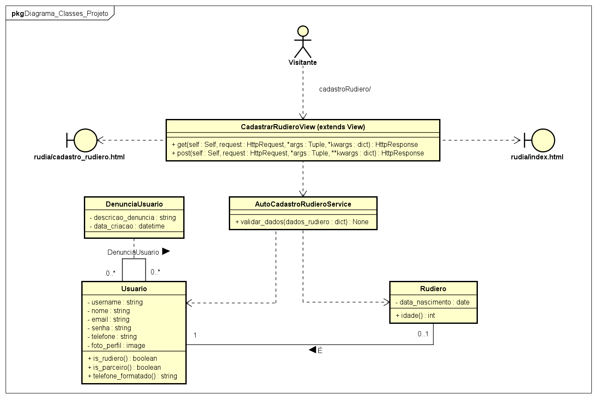

# CDU007. Realizar Auto Cadastro de Rudiero

- **Ator principal**: Visitante
- **Atores secundários**: -
- **Resumo**: Visitante realiza o cadastro de acesso de Rudiero no sistema
- **Pré-condição**:
1. O Visitante não ter realizado o cadastro no sistema
2. O Visitante deve acessar a tela de cadastro de Rudiero
- **Pós-Condição**: 
1. Criação e persistência da conta de Rudiero no sistema
2. Redirecionado para a tela de login

## Fluxo Principal
| Ações do ator | Ações do sistema |
| :-----------------: | :-----------------: | 
| 0 - na tela inicial, o visitante clica no botão 'entrar' | - |  
| - | 1 - o sistema exibe o modal de login e cadastro |
| 2 - o visitante clica no botão 'criar conta' | - |
| - | 3 - na tela de cadastro, o sistema solicita o preenchimento dos campos 'username', 'nome', 'e-mail' e 'senha' |
| 4 - o visitante preenche os campos com os dados solicitados e clica em 'criar conta' | - |
| - | 5 - o cadastro é realizado e um e-mail de verificação é enviado ao e-mail informado pelo visitante |
| 6 - o visitante acessa seu e-mail e acessa o link para verificar sua conta | - |
| - | 7 - o sistema informa que o cadastro foi realizado, os dados do cliente são persistidos e acontece o redirecionamento para a tela de login |

## Fluxo Alternativo I - Dados já persistidos no sistema
| Ações do ator | Ações do sistema |
| :-----------------: | :-----------------: | 
| - | 4.1 - o sistema informa que os dados fornecidos ('username' e/ou 'e-mail') já estão registrados e solicita a correção (retorna ao passo 3) |

## Fluxo Alternativo II - Dados inválidos
| Ações do ator | Ações do sistema |
| :-----------------: | :-----------------: | 
| - | 4.2 - o sistema informa que os dados fornecidos são inválidos e solicita a correção (retorna ao passo 3) |

## Diagrama de Interação (Sequência)

### [Documento Astah do Projeto Rudiá](../documento_projeto_rudia_astah/Documento_Projeto_Rudia.asta)

## Diagrama de Classes de Projeto

### [Documento Astah do Projeto Rudiá](../documento_projeto_rudia_astah/Documento_Projeto_Rudia.asta)
