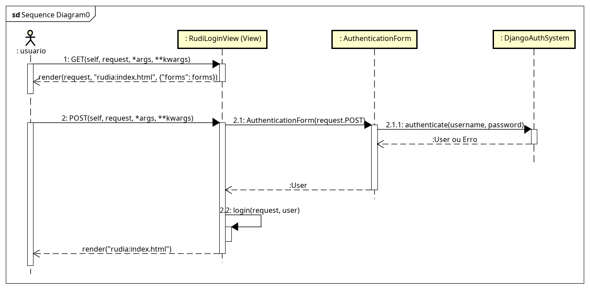
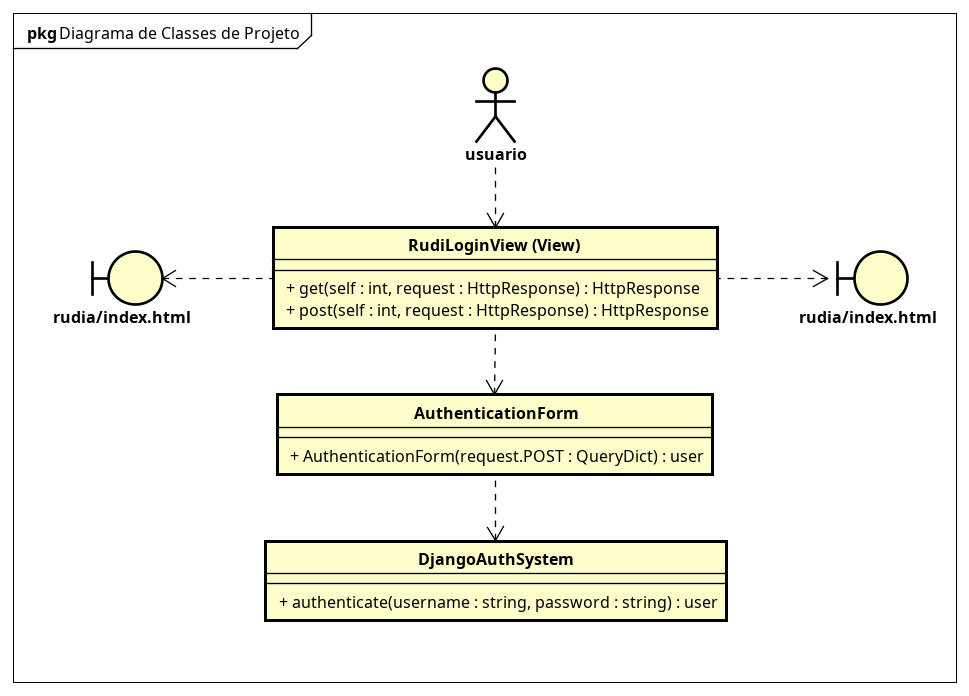

# **CDU008. Abrir Sessão**

* **Ator principal**: Visitante
* **Atores secundários**: -
* **Resumo**: O visitante realiza o login no sistema para acessar funcionalidades exclusivas para usuários autenticados.
* **Pré-condição**: O visitante deve possuir uma conta previamente cadastrada e validada no sistema.
* **Pós-Condição**: O usuário é autenticado com sucesso, e uma nova sessão é iniciada.

---

## ✅ Fluxo Principal

|                         Ações do ator                        |                                                                Ações do sistema                                                               |
| :----------------------------------------------------------: | :-------------------------------------------------------------------------------------------------------------------------------------------: |
| 0 - Na tela inicial, o visitante clica no botão **"Entrar"** |                                                                       -                                                                       |
|                               -                              |                                              1 - O sistema exibe o modal com os campos para login                                             |
|          1 - O visitante preenche o campo **username**         |                                                                       -                                                                       |
|          2 - O visitante preenche o campo **senha**          |                                                                       -                                                                       |
|          3 - O visitante clica no botão **"Entrar"**         |                                                                       -                                                                       |
|                               -                              |                                               4 - O sistema valida os dados de login fornecidos                                               |
|                               -                              |                                           5 - O sistema autentica o usuário e inicia uma nova sessão                                          |
|                               -                              | 6 - O sistema redireciona o usuário para a tela inicial personalizada (painel ou feed) conforme seu perfil (Rudiero, Parceiro, Administrador) |

---

## 🔁 Fluxo Alternativo I - Dados Incorretos

| Ações do ator |                                                 Ações do sistema                                                 |
| :-----------: | :--------------------------------------------------------------------------------------------------------------: |
|       -       |              4.1 - O sistema identifica que o username ou a senha não correspondem a uma conta válida              |
|       -       | 4.2 - O sistema exibe a mensagem: **"Usuário ou senha inválidos"** e permite nova tentativa (retorna ao passo 1) |

---

## 🔁 Fluxo Alternativo II - Conta não verificada

| Ações do ator |                                                Ações do sistema                                                |
| :-----------: | :------------------------------------------------------------------------------------------------------------: |
|       -       |              4.3 - O sistema identifica que o e-mail está cadastrado, mas ainda não foi verificado             |
|       -       | 4.4 - O sistema exibe a mensagem: **"Conta ainda não verificada. Verifique seu e-mail para ativar sua conta"** |

---

## 🔁 Fluxo Alternativo III - Esqueceu a senha

|                                Ações do ator                                |                            Ações do sistema                           |
| :-------------------------------------------------------------------------: | :-------------------------------------------------------------------: |
| 1.1 - O visitante clica no link **"Esqueci minha senha"** no modal de login |                                   -                                   |
|                                      -                                      |  1.2 - O sistema exibe o campo para informar o e-mail de recuperação  |
|         1.3 - O visitante informa seu e-mail e clica em "Recuperar"         |                                   -                                   |
|                                      -                                      | 1.4 - O sistema envia um e-mail com um link para redefinição de senha |

## Diagrama de Interação (Sequência)

## Diagrama de Classes de Projeto

