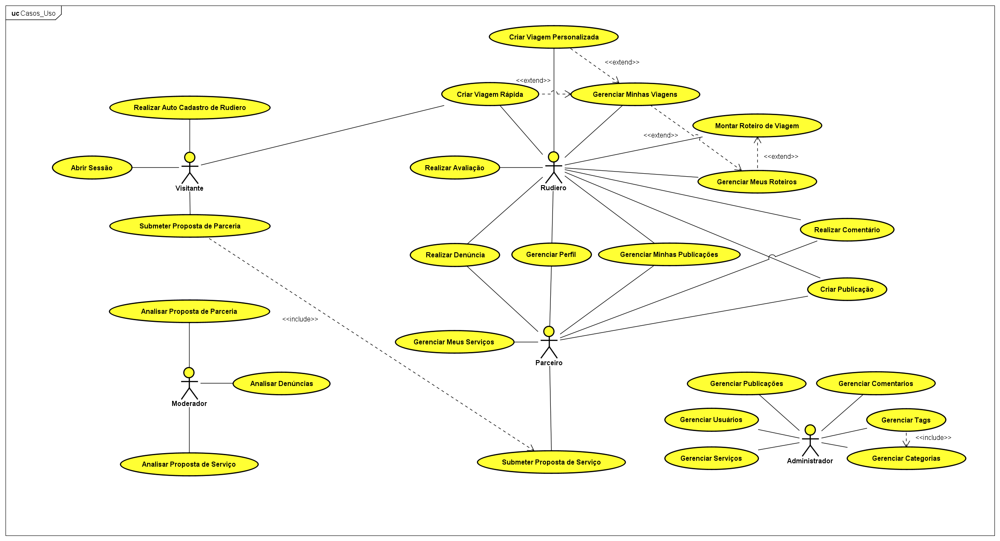

# Modelo de Casos de Uso

## 1. Diagrama de Casos de Uso

### [Documento Astah do Projeto Rudiá](../documento_projeto_rudia_astah/Documento_Projeto_Rudia.asta)

## 2. Listagem dos detalhamentos dos casos de uso

1. [CDU-001 - Criar Viagem Personalizada](cdu-001/detalhamento-001.md)
2. [CDU-002 - Criar Viagem Rápida](cdu-002/detalhamento-002.md)
3. [CDU-003 - Submeter Proposta de Serviço](cdu-003/detalhamento-003.md)
4. [CDU-004 - Submeter Proposta de Parceria](cdu-004/detalhamento-004.md)
5. [CDU-005 - Analisar Proposta de Serviço](cdu-005/detalhamento-005.md)
6. [CDU-006 - Analisar Proposta de Parceria](cdu-006/detalhamento-006.md)
7. [CDU-007 - Realizar Auto Cadastro de Usuário](cdu-007/detalhamento-007.md)
8. [CDU-008 - Abrir Sessão](cdu-008/detalhamento-008.md)
9. [CDU-009 - Realizar Avaliação](cdu-009/detalhamento-009.md)
10. [CDU-010 - Gerenciar Perfil](cdu-010/detalhamento-010.md)
11. [CDU-011 - Gerenciar Meus Serviços](cdu-011/detalhamento-011.md)
12. [CDU-012 - Criar Publicação](cdu-012/detalhamento-012.md)
13. [CDU-013 - Gerenciar Minhas Publicações](cdu-013/detalhamento-013.md)
14. [CDU-014 - Realizar Comentário](cdu-014/detalhamento-014.md)
15. [CDU-015 - Realizar Denúncia](cdu-015/detalhamento-015.md)
16. [CDU-016 - Analisar Denúncia](cdu-016/detalhamento-016.md)
17. [CDU-017 - Gerenciar Meus Roteiros](cdu-017/detalhamento-017.md)
18. [CDU-018 - Montar Roteiro de Viagem](cdu-018/detalhamento-018.md)
19. [CDU-019 - Gerenciar Minhas Viagens](cdu-019/detalhamento-019.md)
