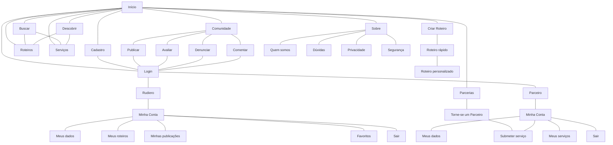

# Protótipos de Interface com o Usuário

## Mapa do Site

## Protótipos de tela

[Link para o projeto no Figma](https://www.figma.com/design/4LHqCSivmd9WjvfWaOOAe7/Rudi%C3%A1---Wireframes?node-id=9-2)

### A. Tela 1: Index

### B. Tela 2: Descobrir

### C. Tela 3: Comunidade

### D. Tela 4: Cadastro

### E. Tela 5: Buscar

### F. Tela 6: Minha conta (rudiero)

### G. Tela 7: Minha conta (parceiro)

### H. Tela 8: Minha conta (administrador)

### I. Tela 9: Roteiro rápido - etapas

### J. Tela 10: Roteiro completo - etapas

### K. Tela 11: Resultados - Criação de roteiros

### L. Tela 12: Formulário de cadastro de parceiros

### M. Tela 13: Formulário de cadastro de serviços

